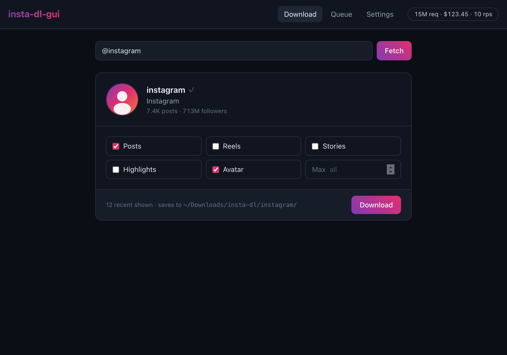

# insta-dl-gui

A simple desktop app to download Instagram posts, reels, stories and highlights — **no Instagram login required**.

Powered by [HikerAPI](https://hikerapi.com/p/uk064a1b), built with [Tauri 2](https://tauri.app) + Vue 3. Downloads run through the HikerAPI cloud instead of a logged-in Instagram session, so there is **no account ban risk** — unlike tools that drive your own account (instaloader, gallery-dl).

## Quick start

1. [Install](installation.md) the app for your platform.
2. Grab a free [HikerAPI token](token.md) — the first 100 requests are on the house.
3. Paste it into the app, then [download away](usage.md).

## What it can download

| Target | Input | Cost |
|---|---|---|
| Single post / reel / carousel | `instagram.com/p/…` or `/reel/…` link | 1 request |
| Profile feed (posts) | `@username` → check **Posts** | 1 request per ~12–18 posts |
| Reels only | `@username` → check **Reels** | 1 request per clips page |
| Active stories | `@username` → check **Stories** | 2 requests |
| Highlights | `@username` → check **Highlights** | 2 requests + 1 per highlight reel |
| HD avatar | `@username` → check **Avatar** | included with profile fetch |

Explore loads current Stories automatically for every public profile, which costs 2 requests. Its **All** action fetches a complete category and may spend additional requests; **Shown** and **Selected** use the exact items already loaded and do not fetch more pages.

## Highlights

- **No login, no ban risk** — a HikerAPI token is the only credential
- **Incremental archives** — already-downloaded files are skipped on re-runs
- **Original timestamps** — file mtime is set from `taken_at`, so Photos/Finder sort correctly
- **JSON metadata sidecars** — caption, like/comment counts and owner saved next to every post
- **Live queue** — per-job progress, byte counters and cancellation
- **Explore first** — start on profile discovery, browse posts/reels/stories, select exact cards, and use one **Download · All · Shown · Selected** control
- **Exact Queue jobs** — each Shown or Selected snapshot becomes one job; snapshots support up to 500 items, with **All** as the complete-archive fallback
- **Local media Library** — search, filter and inspect existing downloads without changing archive files
- **Automatic recovery** — transient network and CDN server errors retry automatically, and partial jobs report only saved files

## Links

- Source: [github.com/subzeroid/insta-dl-gui](https://github.com/subzeroid/insta-dl-gui)
- CLI sibling: [insta-dl](https://github.com/subzeroid/insta-dl) (same output layout, terminal-based)
- Get a token: [hikerapi.com](https://hikerapi.com/p/uk064a1b)

## Disclaimer

insta-dl-gui is not affiliated with, authorized, maintained, or endorsed by Instagram or Meta. It downloads only publicly accessible content via a third-party API service. Respect creators' rights and local law; you are responsible for how you use it.
